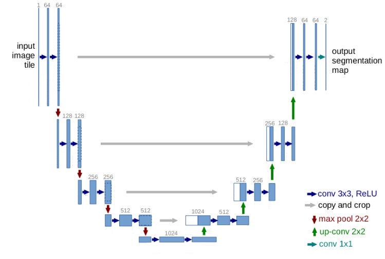
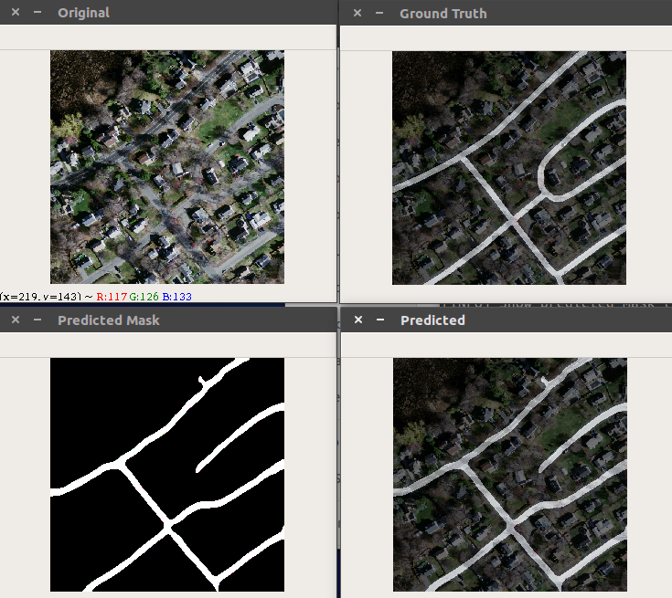
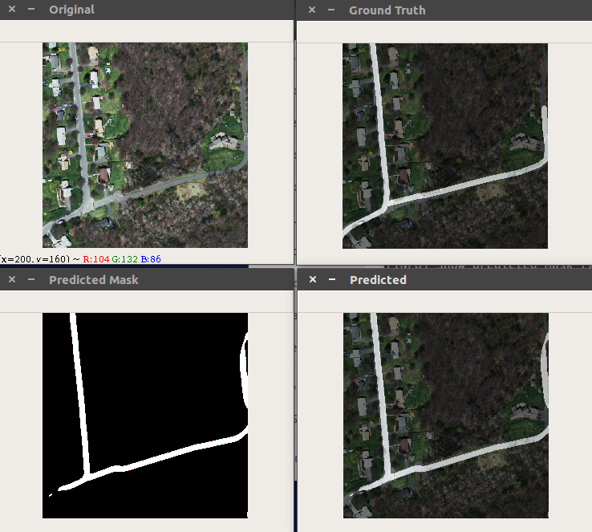
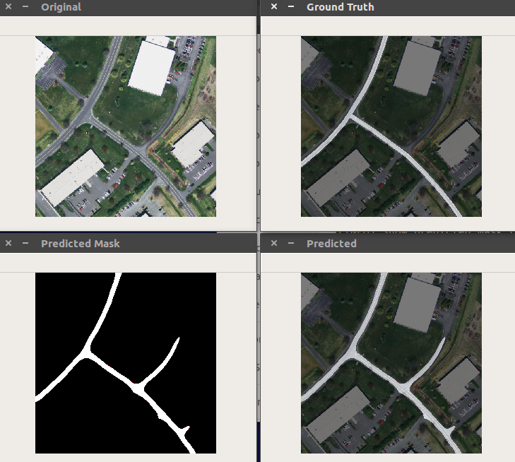
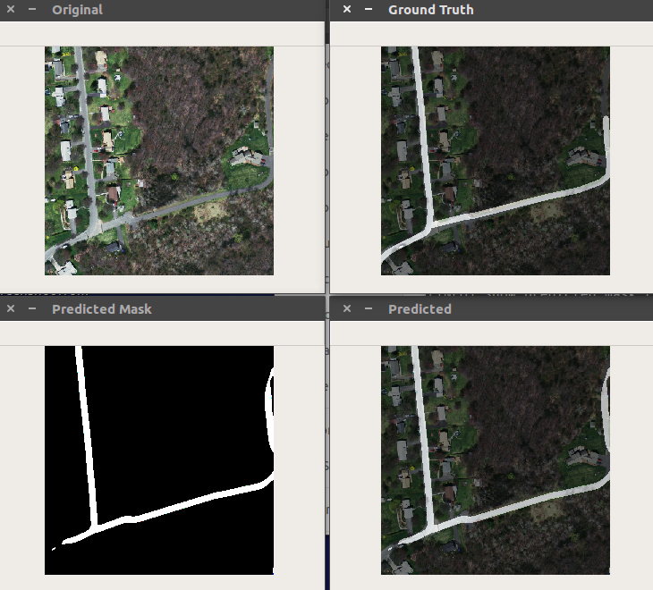

# [A deep learning approach to Road Segmentation](https://github.com/marceloqueiros/DL-road-segmentation)
by [António Silva]() and [Marcelo Queirós](https://www.linkedin.com/in/marceloqueiros/)

## Introduction
Automatic segmentation of roads is sometimes important for identifying roads from satellite images. In some countries, total mapping of roads does not exist and therefore this software proves to be of great importance.
Deep learning is part of a broader family of machine learning methods based on learning data representations, as opposed to task-specific algorithms. At the moment, Deep Learning is the state of the art of computer vision to solve complex problems without well-defined algorithmic rules. This problem fits this description, since the identification of a road does not present trivial and well-defined rules.

[A deep learning approach to Road Segmentation](https://github.com/marceloqueiros/DL-road-segmentation) was implemented in a supervised way, meaning that labelled images were used (original image + road mask). The images to training were taken from https://devblogs.nvidia.com/solving-spacenet-road-detection-challenge-deep-learning/.

## Network
The network that was used was a network already known as succeeded in segmentation works called "unet", which presents the following architecture:

|  |
|:--:| 
| **Fig.1:** Unet - network used in this project. |

## Results
In addition to presenting the code for pre-processing and training the network, there is also a file that test images, for default in "Images/" folder. You should call this file in the cmd of the form "python test_images.py". Some optional parameters can be added like "image directory", "path to template", "width", "height" and "delay". If no parameters are given the file will use the default parameters.
After that, the result will be like the following (real results):

|  |
|:--:| 
| **Fig.2:** Original / GrouthTruth / Predicted / Original + Predicted. |

|  |
|:--:| 
| **Fig.3:** Original / GrouthTruth / Predicted / Original + Predicted. |

|  |
|:--:| 
| **Fig.4:** Original / GrouthTruth / Predicted / Original + Predicted. |

|  |
|:--:| 
| **Fig.5:** Original / GrouthTruth / Predicted / Original + Predicted. |

## Tools
You will need:

* Keras 
* OpenCV
* Basic python libraries (e.g. PIL, numpy)
