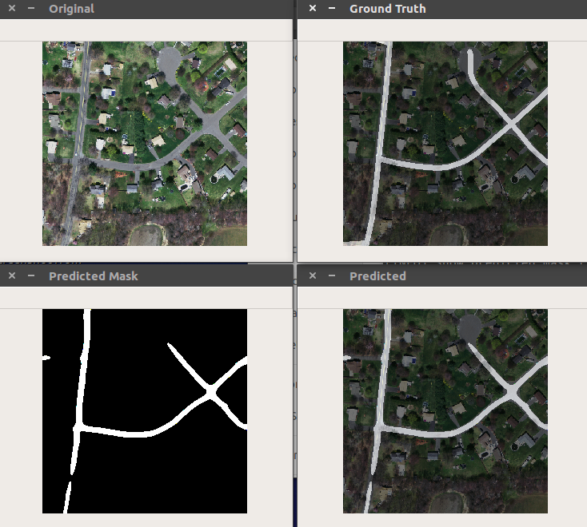

# [A deep learning approach to Road Segmentation](https://github.com/marceloqueiros/DL-road-segmentation)
by [António Silva]() and [Marcelo Queirós](https://www.linkedin.com/in/marceloqueiros/)

[A deep learning approach to Road Segmentation](https://github.com/marceloqueiros/DL-road-segmentation) has been implemented with several options like: 
* Play with 2 human players;
* Play against the computer in easy or expert mode;
* Championship of 10 games and subsequent statistics;
* Players are authenticated, statistics are saved and the status of unfinished games is saved so that they can be resumed.

|  |
|:--:| 
| **Fig.1:** Unet - network used in this project. |

|  |
|:--:| 
| **Fig.2:** Original | GrouthTruth | Prediction | Original + Prediction. |

|  |
|:--:| 
| **Fig.3:** Original | GrouthTruth | Prediction | Original + Prediction. |

|  |
|:--:| 
| **Fig.4:** Original | GrouthTruth | Prediction | Original + Prediction. |

|  |
|:--:| 
| **Fig.5:** Original | GrouthTruth | Prediction | Original + Prediction. |

|  |
|:--:| 
| **Fig.6:** Original | GrouthTruth | Prediction | Original + Prediction. |

